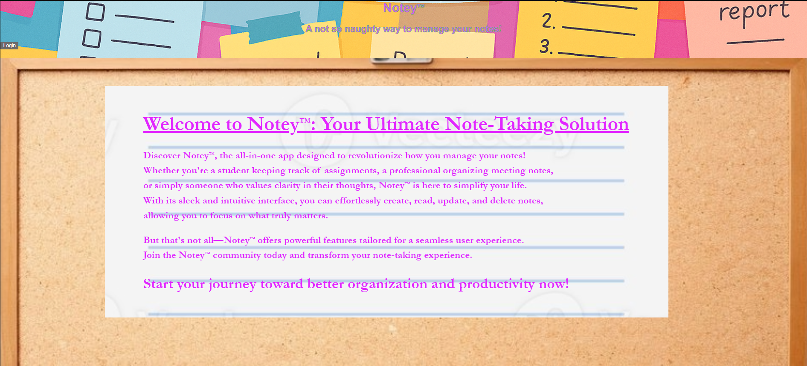
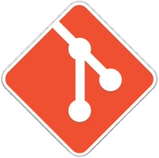

# 📒 Notey

This is a streamlined RESTful API designed for a note-taking application, featuring user authentication that enables users to create, read, update, and delete notes. Notey is developed in Go utilizing the Echo framework, PostgreSQL for data management, and JSON Web Tokens (JWT) for secure authentication.

---


## 🎥 Motivation

I created this Note Taking App because I wanted a simple way to jot down thoughts and ideas without the clutter. As a backend developer with background in DevOps, I aimed to build something that’s not just functional but also easy to use, reliable and scalable. With a focus on quick access and secure data handling, this app is perfect for anyone looking to keep their notes organized and accessible anytime, anywhere. Whether you’re a developer wanting to dive into the code or just someone looking for a handy note-taking tool, I hope you find this project useful and inspiring!

## 🚀 Quick Start

#### 🔧 Prerequisites:
- [Git](https://git-scm.com/)
- [Docker & Docker-compose](https://hub.docker.com/)

#### Clone repo 
```bash
# clone repository from GitHub
git clone https://github.com/OferRavid/notey.git
cd notey
```

#### 🔒 Add secrets
```bash
mkdir secrets
echo "<db-username>" > secrets/db_user.txt
echo "<db-password>" > secrets/db_password.txt
echo "$(openssl rand -base64 64)" > secrets/jwt_key.txt
```
###### (use your own username and password for the database)

#### 🔨 Building the app
```bash
# Build and Run with Docker Compose:
docker-compose up --build
```

This will serve the app at ```localhost:8080/app```

## 📖 Usage

On the site you can:
- Signup to the service.
- Login & Logout.
- Create notes.
- Read notes.
- Update notes.
- Delete notes.

Soon to come: (avilable through the api, but not yet a feature of the front-end)
- update username and password through account settings.
- add photo. (not yet implemented in the backend)
- self deletion of users.

Further still:
- End-to-end encription.
- Categorize notes.
- Sharing.
- Timed reminders.

###### A short guided tour


## 🤝 Contributing

Contributions will be happily welcomed!
This project is under the GNU GPL [License](LICENSE), so anyone is free to use it but have to also abide by this license.

### Submit a pull request

If you'd like to contribute, please fork the repository and open a pull request to the `main` branch.  
I would love your help!  

Please ensure that your code passes the existing tests and linting, and write tests to test your changes if applicable.

# Conclusion

Working on this app was very fun, and I can't wait to see what more I can do with it.

---
---

Authored by Ofer.
